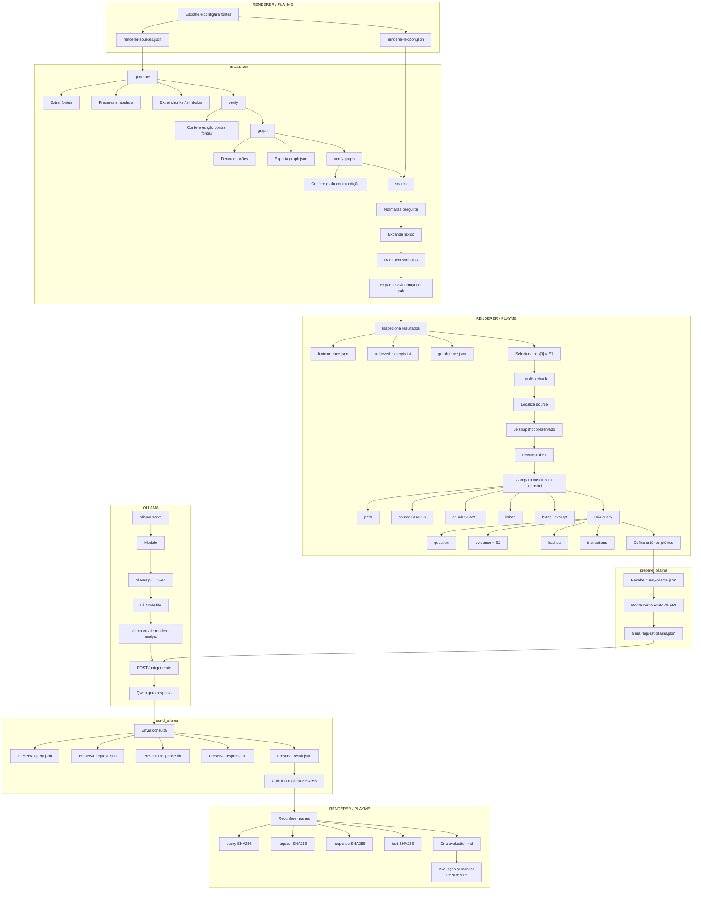
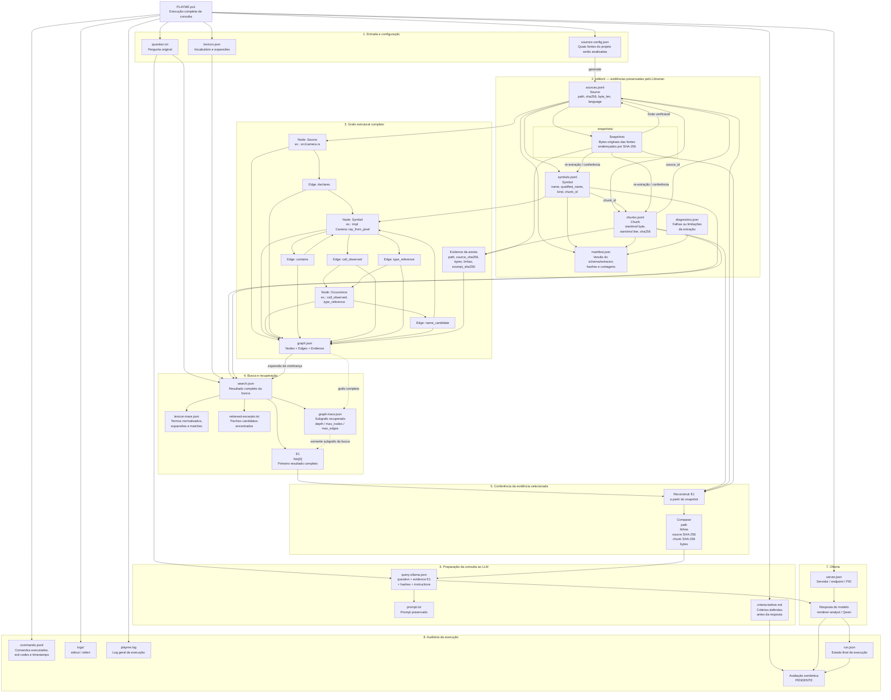

# Workflow completo: renderer, Librarian e Ollama

A única trilha executável está no [PLAYME](PLAYME.ps1). Este fluxograma mostra o fluxo completo entre o renderer, o Librarian e o Ollama, desde a seleção e extração das fontes até a preparação da consulta, envio ao modelo, preservação da resposta e validação final dos artefatos.

# Fluxo de evidências do PLAYME: fontes, grafo, busca e consulta ao Ollama

