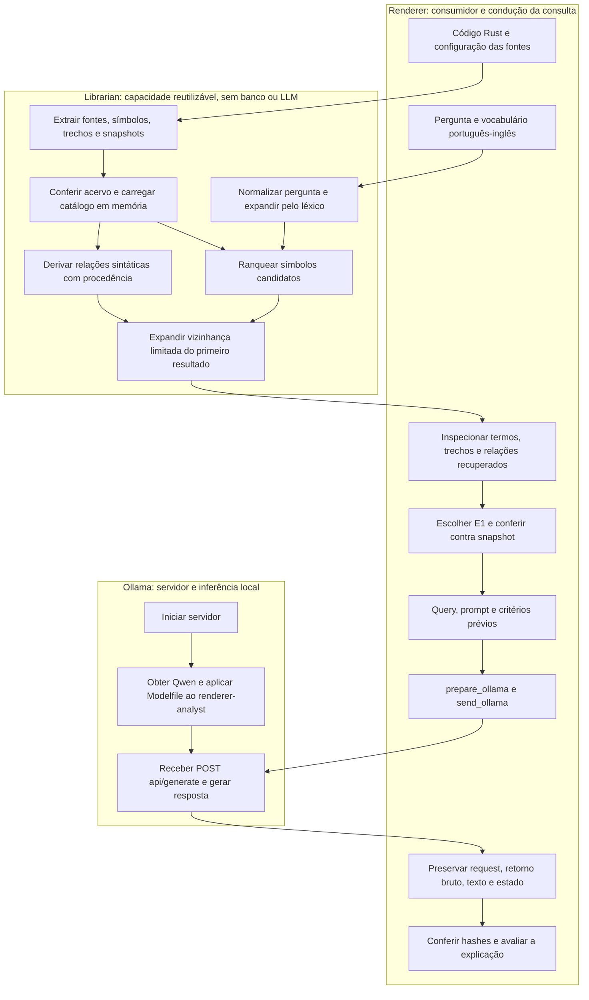

# Workflow conjunto: renderer, Librarian e Ollama

A única trilha executável está no [TESTME](TESTME.md). Este fluxograma explica
as responsabilidades dos dois projetos e o servidor, da geração ao envio.

## Como ler o fluxo

1. O consumidor fornece arquivos/configuração; Librarian preserva bytes e confere
   o acervo. O grafo registra pertencimento, tipos escritos, chamadas observadas e
   candidatos por nome, com intervalos/hashes de origem.
2. A pergunta é normalizada/expandida por vocabulário explícito. O ranking encontra
   símbolos; depois o grafo amplia a vizinhança do primeiro resultado. Não há
   resolução de tipos/chamadas por compilador nem inferência de ligações semânticas.
3. O usuário inspeciona termos, expansões, trechos, relações e cortes. `graph.json`
   é uma exportação; `search` deriva seu grafo em memória dos snapshots, sem carregar
   essa exportação como banco. Sem candidato não há evidência lexical para enviar.
4. A trilha escolhe conscientemente o primeiro trecho completo (E1), confere seus
   bytes e prepara query/prompt. **O grafo inspecionado não é enviado nesse envelope
   compacto.** Outros trechos/relações exigem seleção explícita e orçamento de contexto.
5. Só então inicia/configura Ollama, aplica o Modelfile ao nome `renderer-analyst`
   e envia a consulta. Qwen é o modelo base, Ollama é o servidor, Modelfile é a
   configuração. Editar o arquivo não aplica configuração sem `ollama create`.
6. O consumidor preserva tentativa e avalia a resposta. `completed` é conclusão de
   transporte. Não promove resposta, hipótese ou relação candidata a fato do acervo.

## Fronteira atual

O cliente HTTP pertence ao renderer e não reconfere fontes no envio; registra
`evidence_rechecked=false`. Conferência manual anterior e hashes dentro da query
não são a integração automatizada `dossier_origin`/`selection` do cliente.
O envelope deste roteiro não é um bundle `PreparedQuery`. A ponte automática
da busca ao dossiê/bundle e a biblioteca LLM independente continuam pendentes.

A tentativa real `manual-001/ollama-01` teve HTTP 200 e hashes conferidos, com
avaliação retrospectiva parcialmente correta. O roteiro atual acrescenta critérios
prévios; essa condição não é atribuída retroativamente à tentativa preservada.
Veja a [avaliação preservada](ai/consultas/manual-001/EVALUATION-OLLAMA-01.md).
